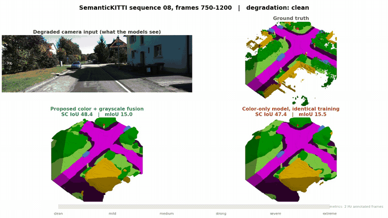
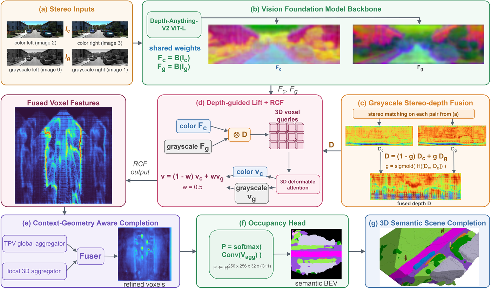

# Illumination-Robust Stereo Semantic Occupancy for Autonomous Driving via Cross-Modal Fusion (IEEE T-ASE 2026)

> Illumination-Robust Stereo Semantic Occupancy for Autonomous Driving via Cross-Modal Fusion
>
> > Yansong Jiang, [Dezong Zhao](https://sites.google.com/site/zhaodezong), Li Zhang

## News

- [2026/09/25]: Accepted by IEEE Transactions on Automation Science and Engineering.
- [2026/09/25]: Code, the trained checkpoint and the demonstration video are released.

## Overview

<p align='center'>

</p>
<p align='center'>
One continuous drive over SemanticKITTI sequence 08, with the illumination degradation ramping
from clean to extreme. The top left panel is what the models see. The proposed fusion is on the
bottom left and a color-only model trained with the identical augmentation is on the bottom
right, both scored against the ground truth on the top right.
</p>

Camera-based semantic scene completion degrades sharply when the illumination is poor. This
repository implements a stereo framework that keeps a second, grayscale stereo pair in the loop.
The grayscale cameras of the KITTI rig carry no color filter array, so they retain more usable
appearance and geometry once the scene goes dark. Two fusion mechanisms bring that evidence into
the network:

- **RCF** (Reliability-weighted Cross-modal Fusion) adds the grayscale image features as a second
  value stream inside the 3D deformable cross-attention of the appearance pathway.
- **GSF** (Grayscale Stereo-depth Fusion) fuses the grayscale stereo-depth volume with the color
  stereo-depth volume through a per-pixel reliability gate in the geometry pathway.

Training applies a synthetic illumination degradation so that the fusion learns where the color
signal-to-noise ratio collapses. No image enhancement front end is used.

## Method

<p align='center'>

</p>

## Results

SemanticKITTI hidden test server (sequences 11 to 21). M is monocular, S is single-frame stereo,
T aggregates several frames, and the dagger marks a stereo-depth-seeded input.

| Method | Setting | Input | SC IoU | mIoU |
|---|---|---|---|---|
| MonoScene | M | Mono | 34.16 | 11.08 |
| OccFormer | M | Mono | 34.53 | 12.32 |
| VoxFormer | T | Stereo† | 43.21 | 13.41 |
| Symphonies | M | Mono | 42.19 | 15.04 |
| SGN | T | Stereo† | **45.42** | 15.76 |
| CGFormer | S | Stereo† | 44.41 | 16.63 |
| HTCL | T | Stereo† | 44.23 | **17.09** |
| **Ours** | S | Stereo C+G | 44.96 | 16.98 |

Graded illumination degradation on the validation sequence. Each entry is mIoU / SC IoU in per
cent, and the last column is the fraction of the clean mIoU that survives.

| Method | Clean | Mild | Medium | Strong | Severe | Extreme | Retained |
|---|---|---|---|---|---|---|---|
| CGFormer | 16.9 / 46.0 | 9.7 / 35.0 | 6.9 / 29.8 | 5.1 / 26.6 | 4.3 / 25.2 | 3.0 / 22.7 | 18% |
| HTCL | 17.1 / 45.5 | 10.7 / 38.1 | 7.9 / 33.6 | 6.0 / 30.3 | 5.1 / 28.6 | 3.7 / 26.1 | 22% |
| VLScene | 17.8 / 44.7 | 10.3 / 37.7 | 7.4 / 32.8 | 5.6 / 29.4 | 4.7 / 27.9 | 3.4 / 25.2 | 19% |
| **Ours** | **18.3 / 47.0** | **14.7 / 41.6** | **12.2 / 38.8** | **10.3 / 36.3** | **9.3 / 34.7** | **7.7 / 31.7** | **42%** |

## Model zoo

| Model | Dataset | SC IoU | mIoU | Checkpoint |
|---|---|---|---|---|
| Proposed | SemanticKITTI test | 44.96 | 16.98 | [Google Drive](https://drive.google.com/file/d/1txU3Eyndc-hj2ecmZesEqF609x9yBQx2/view?usp=sharing) |

```
last.ckpt   2351192359 bytes
sha256      e5c3256e415780026dbb435e6a85e6c18a6dfce63900b4920b8d34379914c561
```

This is the checkpoint submitted to the test server, taken at the end of training rather than at
the best validation score. It contains the frozen Depth-Anything-V2 ViT-L parameters, which are
released by their authors under CC-BY-NC-4.0, so the checkpoint carries that restriction even
though the code here is Apache-2.0. See [NOTICE](NOTICE).

## Installation

The environment follows [docs/install.md](docs/install.md) (Python 3.7, PyTorch 1.10.1 + cu113,
mmcv 1.4.0, mmdet 2.14.0, mmdet3d 0.17.1, pytorch-lightning 1.7.0). Three items are fetched
separately and are not carried in this repository:

1. `packages/`, which holds the mmdetection3d 0.17.1 and DFA3D sources that step (c) of
   `install.md` builds. Copy it from the [CGFormer](https://github.com/pkqbajng/CGFormer)
   repository.
2. [Depth-Anything-V2](https://github.com/DepthAnything/Depth-Anything-V2), cloned into
   `packages/Depth-Anything-V2` or pointed to by the `DAV2_ROOT` environment variable, together
   with its ViT-L depth checkpoint.
3. `swin_tiny_patch4_window7_224.pth` and the released `CGFormer-SemanticKITTI.ckpt`, placed
   under `ckpts/`. Both come from the CGFormer release.

## Data preparation

1. Download the SemanticKITTI voxel labels and the KITTI odometry images. Both the **color** pair
   (`image_2`, `image_3`) and the **grayscale** pair (`image_0`, `image_1`) are needed. The layout
   is described in [docs/dataset.md](docs/dataset.md).

2. Generate stereo depth for each pair with MobileStereoNet. The weights are not shipped here, see
   [preprocess/mobilestereonet/README_weights.md](preprocess/mobilestereonet/README_weights.md).

```
bash preprocess/image2depth_semantickitti.sh
```

   Run it on (`image_2`, `image_3`) for the color depth and on (`image_0`, `image_1`) for the
   grayscale depth, which goes to `depth_gray/`.

3. Build the graded degradation sets for sequence 08:

```
python preprocess/degrade_semantickitti.py \
    --src data/semantickitti/sequences/08 --dst data/semantickitti_degraded
```

   then run MobileStereoNet again on each degraded pair.

## Training

```
CUDA_VISIBLE_DEVICES=0,1,2 python main.py \
    --config_path configs/proposed_semantickitti.py \
    --log_folder proposed_semantickitti --seed 7240 \
    --ckpt_path ckpts/CGFormer-SemanticKITTI.ckpt
```

Training warm-starts the head and the fusion modules from the released CGFormer weights and runs
for the 18000 optimizer steps set by `training_steps`, at batch size 1 per GPU on three GPUs. The
grayscale weight of RCF is fixed at 0.5, and the degradation augmentation is applied with
probability 0.5 to both the image and the stereo depth.

## Evaluation

Clean validation on sequence 08:

```
CUDA_VISIBLE_DEVICES=0 python main.py --eval \
    --config_path configs/proposed_semantickitti.py \
    --ckpt_path <checkpoint> --log_folder eval_clean
```

Graded illumination robustness, one config per level:

```
for level in mild medium strong severe extreme; do
CUDA_VISIBLE_DEVICES=0 python main.py --eval \
    --config_path configs/robust/eval_${level}.py \
    --ckpt_path <checkpoint> --log_folder eval_${level}
done
```

The test-server submission uses `configs/proposed_semantickitti_submit.py` with `--save_path`.

## Acknowledgement

This repository is built on [CGFormer](https://github.com/pkqbajng/CGFormer) and inherits code
from [OccFormer](https://github.com/zhangyp15/OccFormer),
[VoxFormer](https://github.com/NVlabs/VoxFormer) and
[mmdetection3d](https://github.com/open-mmlab/mmdetection3d). Stereo depth is produced with
[MobileStereoNet](https://github.com/cogsys-tuebingen/mobilestereonet), and the shared image
backbone is [Depth-Anything-V2](https://github.com/DepthAnything/Depth-Anything-V2). We thank the
authors for releasing their work.

## Bibtex

If this repository is useful for your research, please consider citing the paper.

```
@article{jiang2026illumination,
  title={Illumination-Robust Stereo Semantic Occupancy for Autonomous Driving via Cross-Modal Fusion},
  author={Jiang, Yansong and Zhao, Dezong and Zhang, Li},
  journal={IEEE Transactions on Automation Science and Engineering},
  year={2026},
  note={Accepted},
  publisher={IEEE}
}
```

## License

The code is released under the Apache License 2.0, see [LICENSE](LICENSE). Model weights are
covered separately, see [NOTICE](NOTICE).
